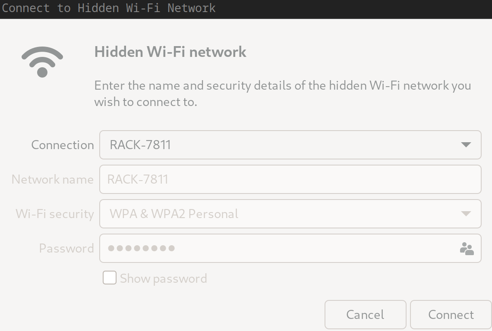
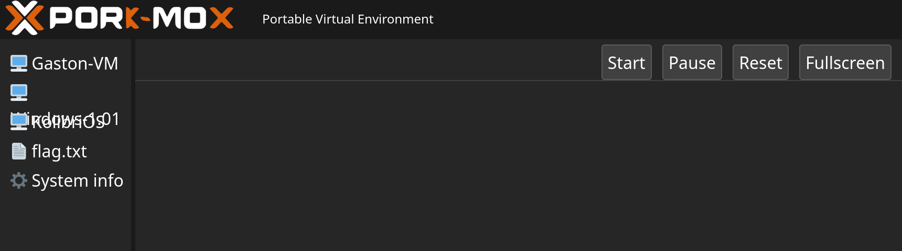
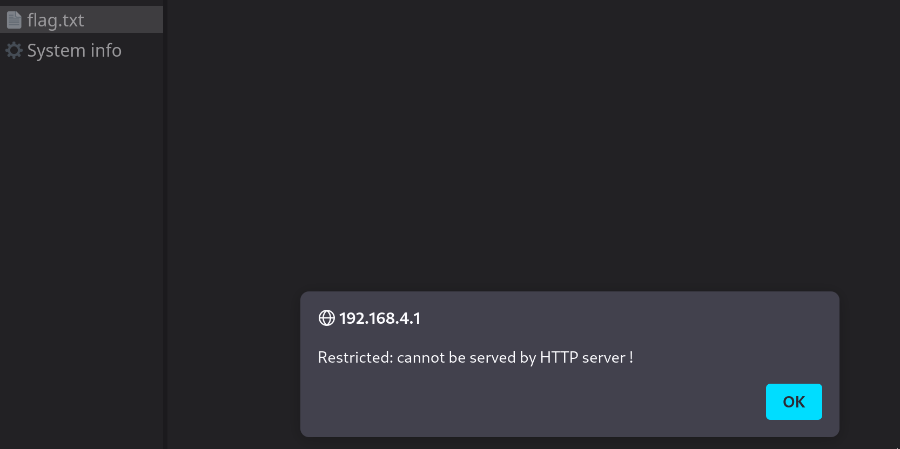
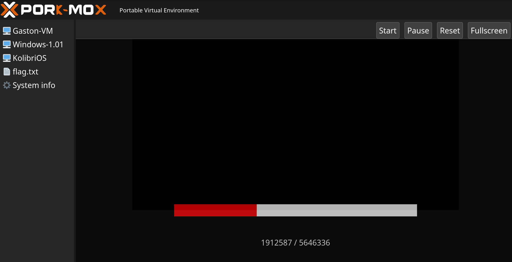
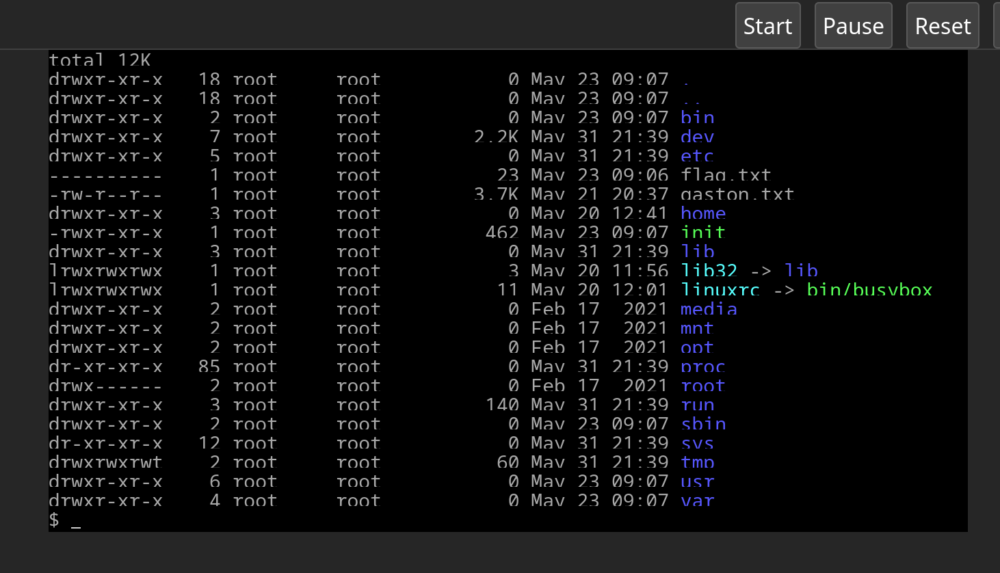
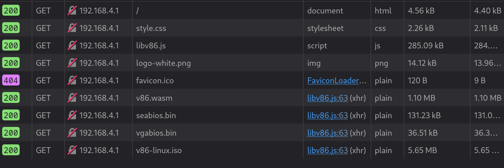

## Part 0 - Exploration

Gaston left us with his device.

According to the documentation there are three buttons:
* Reset
* Info
* Validate

Analyzing the components on the back, there is little to go on:
* A control mini PCB for the LCD screen
* An ESP32-S3-WROOM-1 Wifi/BT module including an ESP32-S3 SoC
* An AMS117 Voltage regulator

We plug the device into our computer, it powers up.

We notice :

* A cryptic message displayed on the screen when we press "Info"
`((1^6)&3&6)&((5^3)&2)&(8^(6&4)^7)&(2^(5&3))&(7^3)`
* A virtual serial device appearing through the USB port

```
Bus 001 Device 002: ID 1a86:7523 QinHeng Electronics CH340 serial converter
```

The CH340 is a drop-in FTDI replacement

We open the device with picocom and notice it might offer some debugging access
to the CHIP through the bootloader

```
$ picocom -b 115200 /dev/ttyUSB0
ESP-ROM:esp32s3-20210327
Build:Mar 27 2021
rst:0xc (RTC_SW_CPU_RST),boot:0x8 (SPI_FAST_FLASH_BOOT)
Saved PC:0x4201d2f0
SPIWP:0xee
mode:DIO, clock div:1
load:0x3fce3808,len:0x44c
load:0x403c9700,len:0xbe4
load:0x403cc700,len:0x2a68
entry 0x403c98d4
E (195) esp_core_dump_flash: No core dump partition found!
E (195) esp_core_dump_flash: No core dump partition found!
ESP-ROM:esp32s3-20210327
Build:Mar 27 2021
rst:0xc (RTC_SW_CPU_RST),boot:0x8 (SPI_FAST_FLASH_BOOT)
Saved PC:0x4208934e
SPIWP:0xee
mode:DIO, clock div:1
load:0x3fce3808,len:0x44c
load:0x403c9700,len:0xbe4
load:0x403cc700,len:0x2a68
entry 0x403c98d4
E (195) esp_core_dump_flash: No core dump partition found!
E (195) esp_core_dump_flash: No core dump partition found!
```

A comprehensive SDK is provided by the chip vendor :
<https://docs.espressif.com/projects/esp-idf/en/latest/esp32/get-started/linux-macos-setup.html>

We fire up git to grab the tools. The Wifi sucks. While we wait, we look at the
LCD sequence.

## Part 1 - Cracking the code (level: easy)

We investigate the printed sequence. This looks like a bitwise expression.

`((1^6)&3&6)&((5^3)&2)&(8^(6&4)^7)&(2^(5&3))&(7^3)`

This can be computed however the result is of little interest, these terms
quickly cancel each other out.

We notice that there is a DIP switch on the board and that the digits in the
formula match the number of switches. Therefore the integer in the formula must
be interpreted as binary values of the corresponding DIP switch rather than a
binary number.

From:
* Rule 1: (1^6) & 3 & 6
* Rule 2: (5^3) & 2
* Rule 3: 8 ^ (6 & 4) ^ 7
* Rule 4: 2 ^ (5 & 3)
* Rule 5: 7^3

We deduce:
* 3 is set (rule 1)
* 6 is set (rule 1)
* 7 is unset (rule 5)
* 2 is set (rule 2)
* 5 is unset (rule 2)
* 1 is unset (rule 1)

Finally 4 is set & 8 is unset or 8 is set & 4 is unset per Rule 3

We input the following combination on the DIP switch:
01110100

And press the Validation button

The screen updates and ask to reset DIP switches back to 0

We proceed and obtain the following WiFi credentials along with the FLAG:
```
STHACK{TECHN0_L0G1C}
SSID: RACK-7811
KEY: CCE18599
```

## Part 2 - Forensics (level: easy)

The board is now exposing a WIFI network over a hidden SSID

Let's connect



Default gateway is available at 192.168.4.1

```
❯ ip route
default via 192.168.4.1 dev wlp1s0f0 proto dhcp src 192.168.4.2 metric 20600
```

Gaston probably heard about VMWare controversial changes.
He's running PORK-MOX instead which looks like a great OSS alternative.

On this instance we find 3 VMs and a systeminfo file.


There is also a flag.txt which can't be accessed at this time.


By blicking on the Gaston-VM we can load it


Then start it using the appropriate "Start" button

We're dopped into a shell
A quick look around reveals a flag.txt but we can't open it since we're a
regular user and it has a 000 permission set.


Looking at what happen from the Developper console of Firefox, we can see a
bunch of files are downloaded, including an .iso file which is the system we
are booting:


We download that file (and the other VMs), we can mount it:

```
❯ sudo mount v86-linux.iso /mnt/drive1/
mount: /mnt/drive1: WARNING: source write-protected, mounted read-only.
```

There's not much there
```
❯ find /mnt
/mnt
/mnt/drive1
/mnt/drive1/boot
/mnt/drive1/boot/bzImage
/mnt/drive1/boot.catalog
/mnt/drive1/isolinux
/mnt/drive1/isolinux/isolinux.bin
/mnt/drive1/isolinux/isolinux.cfg
/mnt/drive1/isolinux/ldlinux.c32
/mnt/drive2
```

We assume the bzImage must contain an initramfs with the rootfs let's binwalk it
```
❯ binwalk /mnt/drive1/boot/bzImage

DECIMAL       HEXADECIMAL     DESCRIPTION
--------------------------------------------------------------------------------
16512         0x4080          gzip compressed data, maximum compression, from Unix, last modified: 1970-01-01 00:00:00 (null date)
5076259       0x4D7523        bix header, header size: 64 bytes, header CRC: 0x508D83, created: 2072-06-08 21:54:08, image size: 1347872950 bytes, Data Address: 0x2C000083, Entry Point: 0xC41831DB, data CRC: 0xFFE06690, image name: "S"
```

We extract an elf file
```
ey3ball@tycho ...ctf/sthack/_bzImage.extracted
$ file 4080
4080: ELF 32-bit LSB executable, Intel 80386, version 1 (SYSV), statically linked, BuildID[sha1]=d7d53ccca320ba2b163fcc0c5f4999e4f39222b7, stripped
```

We can binwalk that file to find the rootfs cpio archive
```
$ binwalk -e 4080
[..]
$ file *
4F96A0.lzo: lzop compressed data - version 0.000,
5B4629:     ASCII cpio archive (SVR4 with no CRC)
5B4629.xz:  XZ compressed data, checksum SHA-256
7641C0:     ASCII cpio archive (SVR4 with no CRC)
```

The rootfs cpio archive is here let's extract it:
```
$ cpio -i < 5B4629
4162 blocks
```

We're in
```
$ ls -alh
total 12M
drwxr-xr-x. 18 ey3ball ey3ball 4.0K May 31 23:49 .
drwxr-xr-x.  3 ey3ball ey3ball 4.0K May 31 23:47 ..
-rw-r--r--.  1 ey3ball ey3ball 3.9M May 31 23:47 4F96A0.lzo
-rw-r--r--.  1 ey3ball ey3ball 2.1M May 31 23:47 5B4629
-rw-r--r--.  1 ey3ball ey3ball 3.2M May 31 23:47 5B4629.xz
-rw-r--r--.  1 ey3ball ey3ball 2.1M May 31 23:47 7641C0
drwxr-xr-x.  2 ey3ball ey3ball 4.0K May 31 23:49 bin
drwxr-xr-x.  4 ey3ball ey3ball 4.0K May 31 23:49 dev
drwxr-xr-x.  5 ey3ball ey3ball 4.0K May 31 23:49 etc
-rw-r--r--.  1 ey3ball ey3ball   23 May 31 23:49 flag.txt
-rw-r--r--.  1 ey3ball ey3ball 3.7K May 31 23:49 gaston.txt
drwxr-xr-x.  3 ey3ball ey3ball 4.0K May 31 23:49 home
-rwxr-xr-x.  1 ey3ball ey3ball  462 May 31 23:49 init
drwxr-xr-x.  3 ey3ball ey3ball 4.0K May 31 23:49 lib
lrwxrwxrwx.  1 ey3ball ey3ball    3 May 31 23:49 lib32 -> lib
lrwxrwxrwx.  1 ey3ball ey3ball   11 May 31 23:49 linuxrc -> bin/busybox
drwxr-xr-x.  2 ey3ball ey3ball 4.0K May 31 23:49 media
drwxr-xr-x.  2 ey3ball ey3ball 4.0K May 31 23:49 mnt
drwxr-xr-x.  2 ey3ball ey3ball 4.0K May 31 23:49 opt
drwxr-xr-x.  2 ey3ball ey3ball 4.0K May 31 23:49 proc
drwx------.  2 ey3ball ey3ball 4.0K May 31 23:49 root
drwxr-xr-x.  2 ey3ball ey3ball 4.0K May 31 23:49 run
drwxr-xr-x.  2 ey3ball ey3ball 4.0K May 31 23:49 sbin
drwxr-xr-x.  2 ey3ball ey3ball 4.0K May 31 23:49 sys
drwxrwxrwt.  2 ey3ball ey3ball 4.0K May 31 23:49 tmp
drwxr-xr-x.  6 ey3ball ey3ball 4.0K May 31 23:49 usr
drwxr-xr-x.  4 ey3ball ey3ball 4.0K May 31 23:49 var
```

Let's just read the flag now
```
$ cat flag.txt
STHACK{CL1ENT_S1D3_VM}
```

## Part 3 - Embedded SDK (level: hard)

We finish part 2 just in time, we're finally done cloning the ESP32 SDK

We assume our target is now the inacessible flag.txt we could see on the web
interface. We go back and download the remaining files:
```
sha1sum:
eba29bc7f59b382c60d092bbf8131754ef1a08b2  info
260bf9f3f2bb690402b02fa6848a8a64f149cb51  kolibri.img
971b108f0b54cb7cee726a6773e5d5db1d777049  v86-linux.iso
100301c5c1450095b76faae95d2882a24d100b13  windows101.img
```

We play colibri for a while, then decide the best course of action would be to
try and extract the device firmware at this point.

### Bootstraping our ESP dev environement

We look for a way to set the device into bootloader mode.

According to the datasheet holding down GPIO0 & GPIO46 would do just that:

Before we attempt some physical modification, a little birdie reminds us of
Gaston's instruction. simply holding the top button will trigger the UART
download mode:

Now we're in business, we can run flash-id to collect some information about
the device :
```
$ esptool.py flash_id
esptool.py v4.8.dev3
Found 34 serial ports
Serial port /dev/ttyUSB0
Connecting...
Detecting chip type... ESP32-S3
Chip is ESP32-S3 (QFN56) (revision v0.2)
Features: WiFi, BLE, Embedded PSRAM 8MB (AP_3v3)
Crystal is 40MHz
MAC: 24:58:7c:e1:e2:c4
Uploading stub...
Running stub...
Stub running...
Manufacturer: c8
Device: 4018
Detected flash size: 16MB
Flash type set in eFuse: quad (4 data lines)
Flash voltage set by eFuse to 3.3V
Hard resetting via RTS pin...
```

Then we can proceed with dumping the flash memory :
```
esptool.py --baud 1115200 --chip auto --port /dev/ttyUSB0 read_flash  --flash_size detect  0 ALL flash_contents.bin
```

This takes forevever. We latern realize we can speed this up but increasing the
baudrate up to 1500000.

### Exploring flash encryption

What does this flash contain ? Well not much ...
```
$ file flash_contents.bin
flash_contents.bin: data

$ binwalk flash_contents2.bin

DECIMAL       HEXADECIMAL     DESCRIPTION
--------------------------------------------------------------------------------
```

Could this possibly be encrypted ? We look for answers in the ESP
documentation.

It turns out there's a security guide
<https://docs.espressif.com/projects/esp-idf/en/latest/esp32/security/flash-encryption.html>

Let's look at the efuse configuration to understand the current state of the
device (edited to retain only interesting bits):
```
$ espefuse.py summary
espefuse.py v4.8.dev3
Connecting...
Detecting chip type... ESP32-S3

=== Run "summary" command ===
EFUSE_NAME (Block) Description  = [Meaningful Value] [Readable/Writeable] (Hex Value)
----------------------------------------------------------------------------------------
Config fuses:
WR_DIS (BLOCK0)                                    Disable programming of individual eFuses           = 4294819837 R/W (0xfffdbffd)
RD_DIS (BLOCK0)                                    Disable reading from BlOCK4-10                     = 3 R/- (0b0000011)

[..]

Security fuses:
DIS_FORCE_DOWNLOAD (BLOCK0)                        Set this bit to disable the function that forces c = False R/- (0b0)
                                                   hip into download mode                            
DIS_DOWNLOAD_MANUAL_ENCRYPT (BLOCK0)               Set this bit to disable flash encryption when in d = False R/- (0b0)
                                                   ownload boot modes                                
SPI_BOOT_CRYPT_CNT (BLOCK0)                        Enables flash encryption when 1 or 3 bits are set  = Enable R/- (0b001)
                                                   and disabled otherwise                            
KEY_PURPOSE_0 (BLOCK0)                             Purpose of Key0                                    = XTS_AES_256_KEY_1 R/- (0x2)
KEY_PURPOSE_1 (BLOCK0)                             Purpose of Key1                                    = XTS_AES_256_KEY_2 R/- (0x3)
SECURE_BOOT_EN (BLOCK0)                            Set this bit to enable secure boot                 = False R/- (0b0)
SECURE_BOOT_AGGRESSIVE_REVOKE (BLOCK0)             Set this bit to enable revoking aggressive secure  = False R/- (0b0)
                                                   boot                                              
DIS_DOWNLOAD_MODE (BLOCK0)                         Set this bit to disable download mode (boot_mode[3 = False R/- (0b0)
                                                   :0] = 0; 1; 2; 3; 6; 7)                           
ENABLE_SECURITY_DOWNLOAD (BLOCK0)                  Set this bit to enable secure UART download mode   = False R/- (0b0)
SECURE_VERSION (BLOCK0)                            Secure version (used by ESP-IDF anti-rollback feat = 0 R/- (0x0000)
                                                   ure)                                              
BLOCK_KEY0 (BLOCK4)
  Purpose: XTS_AES_256_KEY_1
  Key0 or user data                                 
   = ?? ?? ?? ?? ?? ?? ?? ?? ?? ?? ?? ?? ?? ?? ?? ?? ?? ?? ?? ?? ?? ?? ?? ?? ?? ?? ?? ?? ?? ?? ?? ?? -/- 
BLOCK_KEY1 (BLOCK5)
  Purpose: XTS_AES_256_KEY_2
  Key1 or user data                                 
   = ?? ?? ?? ?? ?? ?? ?? ?? ?? ?? ?? ?? ?? ?? ?? ?? ?? ?? ?? ?? ?? ?? ?? ?? ?? ?? ?? ?? ?? ?? ?? ?? -/- 
```

We can see here that encryption keys are indeed provisioned in
BLOCK_KEY0/BLOCK_KEY. We can't read those because of RD_DIS.

We can also see that flash encryption is enabled (SPI_BOOT_CRYPT_CNT)

However DIS_FORCE_DOWNLOAD is unset and SECURE_BOOT_EN is disabled.

We explore the doc, looking for more info.

In particular this page has an interesting mention : 
<https://docs.espressif.com/projects/esp-idf/en/latest/esp32/security/flash-encryption.html#flash-encryption-process>

```Development Mode - recommended for use only during development. In this mode, it is still possible to flash new plaintext firmware to the device, and the bootloader will transparently encrypt this firmware using the key stored in hardware. This allows, indirectly, to read out the plaintext of the firmware in flash.```

Too bad the doc does not explain how to break encryption in this mode !

Let's take a step back right now we have :
* A device with an encryption that we can't read
* We can however flash a new firmware, and the device with transparently
  encrypt it for us
* The doc hints this might be used to read the plaintext firmware

### Hitting a deadend with the ESP tooling 

Should we try to reflash the device ? We actually have a dump of the flash now,
what's the worth that could happen ? Maybe is a we reflash the encrypted
firmware the device would decrypt it for us (I suck at crypto but I remember
something about AES beein symmetric)

Let's try reflashing the firmware and reading it back again :
```
esptool.py --baud 1500000 --chip auto --port /dev/ttyUSB0 write_flash --flash_size detect  0 flash_contents.bin
esptool.py --baud 1500000 --chip auto --port /dev/ttyUSB0 read_flash --flash_size detect  0 ALL flash_contents2.bin
```

The result is disapppointing:
```
37a6b3b6d84a76d67758778a7ec35934c6169314  flash_contents2.bin
37a6b3b6d84a76d67758778a7ec35934c6169314  flash_contents.bin
```

We keep reading about the various fuses and configuration flags, it turns out that:
* Despite the encryption we can still reflash the device is direct mode
  bypassing encryption (that's what we did here)
* But flashing a plain binary would result in a unbootable device
* There's actually a separate command to flash & encrypt

We try it read back the result:
```
esptool.py --baud 1500000 --chip auto --port /dev/ttyUSB0 write_flash --encrypt --flash_size detect  0 flash_contents2.bin
esptool.py --baud 1500000 --chip auto --port /dev/ttyUSB0 read_flash --flash_size detect  0 ALL flash_contents3.bin
```

We hit a dead end :
* Our device doesn't boot anymore
* The file we read back is still garbage, turns out AES is not so symmetric
  atfer all XD

Time to take a step back : we can't decrypt the flash because we don't have
access to encryption key. But who can ? The device itself.

We've seen we can successfully flash something onto the device, why not try to
roll out our own firmware ? It turns out the ESP sdk is filled with countless
examples.

### Developping for the ESP32 

We look around in the SDK, a specific folder grabs out attention :
`examples/get-started/hello_world`

Let's see if we can manage to run this code on the device

Initially we attempt to build the code and load it directly into RAM, thinking
we don't want to touch the flash to avoid destructing the data we want to
access.

However nothing works, there is a load_ram command, and some build flag to
support build, but they are flagged as experimental.

After a while we give up. **Let's simply scratch the device and get the hello
world running. We have a flash dump, we'll think later about how to keep the
target data.**

A key point in getting our code to run is getting it to build in the right
mode. Remember that we're read into the docs that we MUST flash our code
encrypted or the device won't boot.

Turns out the SDK exposes a kernel-style menuconfig interface:
```
idf.py menuconfig
```

We take care of enabling the right flags : we want to build in devmode (to
keep the ability to reflash) with on the fly flash encryption enabled

Then after some trial & error we find the right sequence to flash our device:
```
$ idf.py menuconfig
# and enable the right flags
$ idf.py build
$ idf.py -p /dev/ttyUSB0 encrypted-flash
```
For some reason the monitor command that's supposed to reboot the device and
display the serial output doesn't work, we almost give up when finally we
simply power cycle it ...

```
uild:Mar 27 2021
rst:0xc (RTC_SW_CPU_RST),boot:0x9 (SPI_FAST_FLASH_BOOT)
Saved PC:0x40375894
SPIWP:0xee
mode:DIO, clock div:1
load:0x3fce2980,len:0x2b58
load:0x403c8700,len:0x4
load:0x403c8704,len:0xcb8
load:0x403cb700,len:0x447c
entry 0x403c8914
I (39) boot: ESP-IDF v5.4-dev-421-g4523f2d674-dirty 2nd stage bootloader
I (39) boot: compile time Jun  1 2024 00:34:14
I (40) boot: Multicore bootloader
I (44) boot: chip revision: v0.2
I (48) boot.esp32s3: Boot SPI Speed : 80MHz
I (53) boot.esp32s3: SPI Mode       : DIO
I (57) boot.esp32s3: SPI Flash Size : 2MB
I (62) boot: Enabling RNG early entropy source...
I (68) boot: Partition Table:
I (71) boot: ## Label            Usage          Type ST Offset   Length
I (78) boot:  0 nvs              WiFi data        01 02 00009000 00006000
I (86) boot:  1 phy_init         RF data          01 01 0000f000 00001000
I (93) boot:  2 factory          factory app      00 00 00010000 00100000
I (101) boot: End of partition table
I (105) esp_image: segment 0: paddr=00010020 vaddr=3c020020 size=0a6e8h ( 42728) map
I (122) esp_image: segment 1: paddr=0001a710 vaddr=3fc91a00 size=02934h ( 10548) load
I (125) esp_image: segment 2: paddr=0001d04c vaddr=40374000 size=02fcch ( 12236) load
I (134) esp_image: segment 3: paddr=00020020 vaddr=42000020 size=17f5ch ( 98140) map
I (159) esp_image: segment 4: paddr=00037f84 vaddr=40376fcc size=0a978h ( 43384) load
I (175) boot: Loaded app from partition at offset 0x10000
I (176) boot: Checking flash encryption...
I (176) flash_encrypt: flash encryption is enabled (0 plaintext flashes left)
I (183) boot: Disabling RNG early entropy source...
I (199) cpu_start: Multicore app
I (209) cpu_start: Pro cpu start user code
I (209) cpu_start: cpu freq: 160000000 Hz
I (209) app_init: Application information:
I (212) app_init: Project name:     hello_world
I (217) app_init: App version:      v5.4-dev-421-g4523f2d674-dirty
I (224) app_init: Compile time:     May 25 2024 02:07:18
I (230) app_init: ELF file SHA256:  e1f8ce9b9...
I (236) app_init: ESP-IDF:          v5.4-dev-421-g4523f2d674-dirty
I (242) efuse_init: Min chip rev:     v0.0
I (247) efuse_init: Max chip rev:     v0.99 
I (252) efuse_init: Chip rev:         v0.2
I (257) heap_init: Initializing. RAM available for dynamic allocation:
I (264) heap_init: At 3FC94BE8 len 00054B28 (338 KiB): RAM
I (270) heap_init: At 3FCE9710 len 00005724 (21 KiB): RAM
I (276) heap_init: At 3FCF0000 len 00008000 (32 KiB): DRAM
I (283) heap_init: At 600FE100 len 00001EE8 (7 KiB): RTCRAM
I (290) spi_flash: detected chip: gd
I (293) spi_flash: flash io: dio
W (297) spi_flash: Detected size(16384k) larger than the size in the binary image header(2048k). Using the size in the binary image header.
W (310) flash_encrypt: Flash encryption mode is DEVELOPMENT (not secure)
I (339) sleep: Configure to isolate all GPIO pins in sleep state
I (339) sleep: Enable automatic switching of GPIO sleep configuration
I (342) main_task: Started on CPU0
I (352) main_task: Calling app_main()
Hello Benja!
This is esp32s3 chip with 2 CPU core(s), WiFi/BLE, silicon revision v0.2, 2MB external flash
Minimum free heap size: 392156 bytes
Restarting in 10 seconds...
Restarting in 9 seconds...
Restarting in 8 seconds...
Restarting in 7 seconds...
Restarting in 6 seconds...
Restarting in 5 seconds...
```

And boom ! We're in

Things are finally getting interesting

### Trying to to find the data 

### Partitions ?

We flash black the initial version of the flash we dumped earlier. Power cycle
the device, the StHack logo show up again.

Great now we have a way to restore the original firmware, and a way to flash
the new one. How do we go from there ? From must flash a new firmware while
keeping the existing data, then we could like to read it from our custom
firmware.

How do we do that ? Turns out these devices have some sort of partitioning and
code can be stored separately from the more mundane filesystem data.

We explore the code samples again, a bit catches our eye:
`cd examples/storage/parttool`

Surely it could be nice if we could have a look around !

There's a firmware dedicated to reading partition data & an associated python
script that is suppose to use it and print the discovered information.

We built it we try to run the script to no avail. Nothing is working.

We don't manage to read any info and the tool just errors out or times out,
we're not getting anything out of it.

Then we realize the partition table itself could be encrypted, turns out that
this could be useless in this case.

### Trying to read back data, blind edition 

We keep looking at the examples and we stumble into `storage/litettlefs`

To use it we have to configure a csv file which looks like this
```
--- a/examples/storage/spiffs/partitions_example.csv
+++ b/examples/storage/spiffs/partitions_example.csv
@@ -3,4 +3,4 @@
 nvs,      data, nvs,     0x9000,  0x6000,
 phy_init, data, phy,     0xf000,  0x1000,
 factory,  app,  factory, 0x10000, 1M,
-storage,  data, spiffs,  ,        0xF0000,
+storage,  data, spiffs,  0x110000,0xF0000, encrypted
```

We manage to run it, then we decide to patch the original file to add encrypted flags for the app & data.

Our firmware starts but crashes with a deceiving

```
I (6365) example: Initializing SPIFFS
E (6365) SPIFFS: spiffs can not run on encrypted partition
E (6365) example: Failed to initialize SPIFFS (ESP_ERR_INVALID_STATE)
I (6365) main_task: Returned from app_main()
```

Another dead end, all of our storage read attempts has failed, we're flying
blind, it's around 3:00am and it feels like we're have tried anything at this
point.

### The final spiff of the puzzle ?

A little birdie reminds us we had fetched a bunch a file in part2, and we
immediately remember that we had actually retrieved a system info file earlier
from the PORK-MOX interface.

Arent's we lucky this file actually list the partition layout of the device :
```
####################################################
# Name,   Type, SubType, Offset,   Size,    Flags  #
####################################################
nvs,      data, nvs,     0x9000,   0x6000,
phy_init, data, phy,     0xf000,   0x1000,
factory,  app,  factory, 0x10000,  1M,     encrypted
spiffs,   data, spiffs,  0x110000, 14M,    encrypted
####################################################
#  spiffs filesystem = LittleFS                    #
#  M = Mebibytes                                   #
####################################################
```

But we tried spiffs already ... We notice though **spiffs filesystem = LittleFS**

It turns out spiffs sucks, all the cool kids now use LittleFS
<https://github.com/lorol/LITTLEFS>

We're back in business ? Turns out we have a LittleFS example in the SDK too !

It all makes sense now, we quickly patch the example :
```
--- a/examples/storage/littlefs/main/esp_littlefs_example.c
+++ b/examples/storage/littlefs/main/esp_littlefs_example.c
@@ -14,16 +14,24 @@
 #include "esp_system.h"
 #include "esp_littlefs.h"
+#include "freertos/FreeRTOS.h"
+#include "freertos/task.h"
+
 static const char *TAG = "esp_littlefs";
 
 void app_main(void)
 {
+    for (int i = 5; i >= 0; i--) {
+        printf("Starting in %d seconds...\n", i);
+        vTaskDelay(1000 / portTICK_PERIOD_MS);
+    }
+
     ESP_LOGI(TAG, "Initializing LittleFS");
 
     esp_vfs_littlefs_conf_t conf = {
         .base_path = "/littlefs",
-        .partition_label = "storage",
-        .format_if_mount_failed = true,
+        .partition_label = "spiffs",
+        .format_if_mount_failed = false,
         .dont_mount = false,
     };
```

```
     // Open renamed file for reading
     ESP_LOGI(TAG, "Reading file");
-    f = fopen("/littlefs/foo.txt", "r");
+    FILE* f = fopen("/littlefs/flag.txt", "r");
     if (f == NULL) {
         ESP_LOGE(TAG, "Failed to open file for reading");
         return;
```

We do our usual thing
```
$ idf.py menuconfig
# and enable the right flags
$ idf.py build
$ idf.py -p /dev/ttyUSB0 encrypted-flash
```

Then we fire up our serial console to grab the Flag !
```
Terminal ready
Starting in 3 seconds...
Starting in 2 seconds...
Starting in 1 seconds...
Starting in 0 seconds...
I (6367) esp_littlefs: Initializing LittleFS
I (6747) esp_littlefs: Partition size: total: 14680064, used: 10235904
I (6747) esp_littlefs: Opening file
I (6747) esp_littlefs: Reading file
I (6757) esp_littlefs: Read from file: 'STHACK{I0T_HW_ENCRYPT1ON}'
I (6757) esp_littlefs: Reading from flashed filesystem example.txt
```
